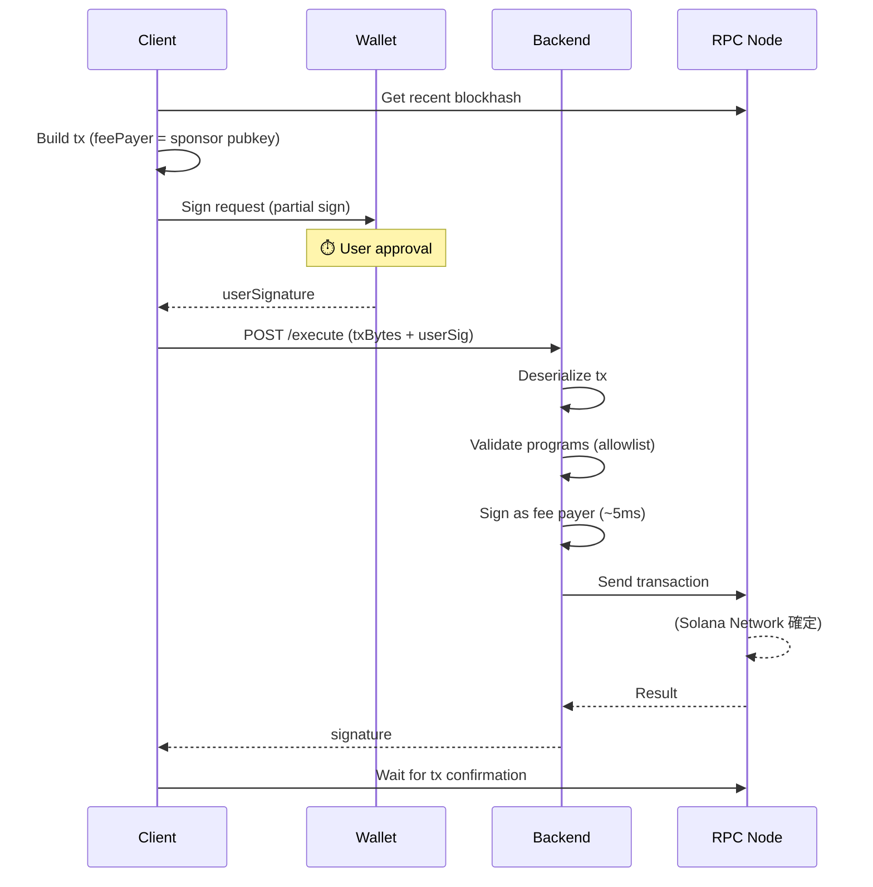
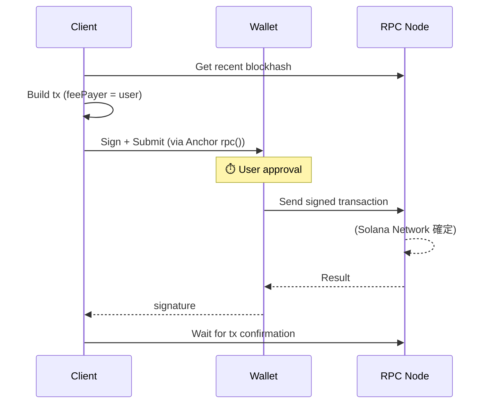

# Sponsored Transaction

## 概要

Solana のスポンサードトランザクションは、ユーザーの代わりにスポンサー（バックエンド）がガス代を支払う仕組み。
本プロジェクトでは Fee Payer パターンを実装している。

## 本質的なオーバーヘッド

### Solana (Account Model)

| 処理 | 理由 |
|------|------|
| **Blockhash 取得 (RPC)** | 最新ブロックハッシュが必要（有効期限あり） |
| **ユーザー署名** | セキュリティ上必須。ウォレット UI の表示時間含む |
| **トランザクション実行 (RPC)** | RPC ノードへの送信・確定待ち |

### Sui (UTXO-like Model) との違い

| 項目 | Solana | Sui |
|------|--------|-----|
| **オブジェクト参照解決** | **不要** | 必須（objectId + version + digest） |
| **ガス見積もり** | 自動 or 固定 | 必須 or setGasBudget |
| **構造的複雑性** | 低い | 高い（UTXO モデル） |

**Solana の優位点**: Account Model のおかげで「オブジェクト参照解決」が不要。これにより構造的にシンプル。

## 2 方式の比較

```text
Normal                 Fee Payer Sponsored (1RT)
──────────────────     ──────────────────────────
[Get Blockhash]        [Get Blockhash]
        ↓                      ↓
[Sign+Execute (rpc)]   [Build tx (feePayer=sponsor)]
        ↓                      ↓
[Wait for tx]          [User partial sign]
        ↓                      ↓
      完了             [Backend sign + execute (1RT)]
                               ↓
                       [Wait for tx]
                               ↓
                             完了
──────────────────     ──────────────────────────
API往復: 0回           API往復: 1回
```

| 方式 | ガス代 | API往復 | 用途 |
|------|--------|---------|------|
| **Normal** | ユーザー負担 | 0 | 日常操作、高頻度 |
| **Fee Payer Sponsored** | スポンサー負担 | 1 | ガス代ゼロ、オンボーディング |

## 実測値

### Solana (localnet)

> **注意**: localnet での計測値。RPC 遅延がほぼゼロのため、devnet/mainnet では大幅に異なる。

```text
┌─ Normal Transaction ─────────────────────────┐
│  1. Get blockhash:          22ms             │
│  2. Sign+Execute (rpc):   3899ms  ⏱️ user    │
│  3. Wait for tx:            97ms             │
├──────────────────────────────────────────────┤
│  System time only:         118ms             │
└──────────────────────────────────────────────┘

┌─ Fee Payer Sponsored (1RT) ──────────────────┐
│  1. Get blockhash:           8ms             │
│  2. Build tx:                0ms             │
│  3. User sign:            4406ms  ⏱️ user    │
│  4. Execute (1RT):         481ms             │
│  5. Wait for tx:           382ms             │
├──────────────────────────────────────────────┤
│  System time only:         871ms             │
└──────────────────────────────────────────────┘

┌─ Backend 処理内訳 ───────────────────────────┐
│  1. Deserialize:             1ms             │
│  2. Sign (sponsor):          5ms             │
│  3. Send tx:                 6ms             │
│  4. Confirm tx:            384ms             │
├──────────────────────────────────────────────┤
│  Backend total:            407ms             │
└──────────────────────────────────────────────┘
```

⏱️ = ユーザー操作待ち時間（System time から除外）

### 時間収支 (MECE)

| 処理 | 必須? | Normal | Sponsored |
|------|-------|--------|-----------|
| **Get Blockhash** | ✅ 必須 | 22ms | 8ms |
| **Build tx** | ✅ 必須 | rpc内 | 0ms |
| **ユーザー署名** | ✅ 必須 | ⏱️ ~3,900ms | ⏱️ ~4,400ms |
| **API呼び出し (1RT)** | 方式依存 | - | 481ms |
| **トランザクション確定** | ✅ 必須 | 97ms | 382ms |
| **System time 合計** | | **118ms** | **871ms** |

**Sponsored のオーバーヘッド**: 871ms - 118ms = **+753ms**

内訳:
- API 呼び出し + Backend 処理: ~481ms
- 確定待ち時間の増加: ~285ms（2署名検証のため）

## Solana vs Sui 比較

### System Time 比較

| 方式 | Solana (localnet) | Sui (testnet) | 差分 |
|------|-------------------|---------------|------|
| **Normal** | 118ms | 3,642ms | Solana が **30x 高速** |
| **Sponsored (1RT)** | 871ms | 3,594ms | Solana が **4x 高速** |
| **Enoki (2RT)** | N/A | 4,197ms | Sui のみ |

> ⚠️ **公平な比較ではない**: Solana は localnet（RPC 遅延ゼロ）、Sui は testnet（実際のネットワーク遅延あり）での計測。

### 構造的な違い

| 項目 | Solana | Sui |
|------|--------|-----|
| **アカウントモデル** | Account Model | UTXO-like Object Model |
| **オブジェクト参照** | 不要（アドレスのみ） | 必要（objectId + version + digest） |
| **署名方式** | PartialSign + Fee Payer | GasOwner + Sender 分離 |
| **Sponsored 方式** | Fee Payer (1RT) | 1RT Pre-allocated / Enoki (2RT) |

### アーキテクチャ上の示唆

**Solana の利点**:
- Account Model により「オブジェクト参照解決」ステップが不要
- トランザクション構築がシンプル

**Sui の利点**:
- UTXO モデルにより並列処理に優れる
- オブジェクト単位の所有権管理

## フロー詳細

### Fee Payer Sponsored Transaction (1RT)



### Normal Transaction



## セキュリティ

### プログラム許可リスト

スポンサーが署名する前に、トランザクションが許可されたプログラムのみを呼び出しているか検証する。

```typescript
const ALLOWED_PROGRAM_IDS = [
  "GPmMruCgQL4HLkt4KDzSRd4KrZ3uRBa3mCzxdtLuAaeY", // shared_counter
  "Afj1Jid7Hwr9Pa7wUnZ4MHVq1MJQtd2Tk3jcTCHJh6rq", // owned_counter
  "11111111111111111111111111111111", // System Program
];
```

### Fee Payer 検証

トランザクションの fee payer がスポンサーの公開鍵と一致することを確認する。

## ユースケース判断

```text
ユーザーがガス代を払える？
├─ Yes → Normal（最速、シンプル）
└─ No → Fee Payer Sponsored（1RT、ガス代ゼロ）
```

## 実装ファイル

| ファイル | 役割 |
|---------|------|
| [useSponsoredTransaction.tsx](../src/hooks/useSponsoredTransaction.tsx) | Sponsored Transaction フック |
| [fee-sponsor.ts](../src/app/api/[[...route]]/routes/fee-sponsor.ts) | バックエンド API |
| [useCounter.ts](../src/hooks/useCounter.ts) | Normal Transaction |
| [OwnedCounter.tsx](../src/components/OwnedCounter.tsx) | Owned Counter UI |
| [SharedCounter.tsx](../src/components/SharedCounter.tsx) | Shared Counter UI |

## 環境変数

```bash
# .env.local
SPONSOR_PRIVATE_KEY=<base58-encoded-private-key>
```

## 参考

- [Solana Transaction Structure](https://solana.com/docs/core/transactions)
- [Anchor Framework](https://www.anchor-lang.com/)
