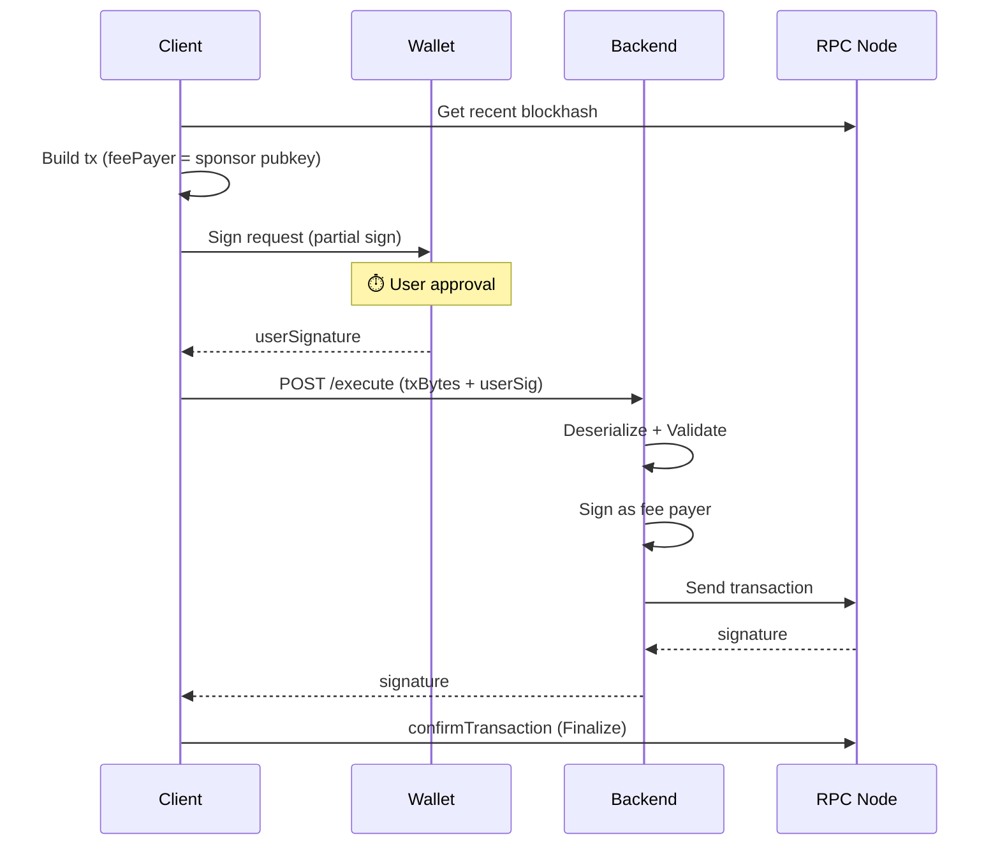

# Sponsored Transaction

## 概要

Solana のスポンサードトランザクションは、ユーザーの代わりにスポンサー（バックエンド）がガス代を支払う仕組み。
本プロジェクトでは Fee Payer パターンを実装している。

## トランザクション処理の時間構成

### 用語定義

| 用語 | 説明 |
|------|------|
| **Get blockhash** | 最新ブロックハッシュ取得（RPC） |
| **Build** | トランザクション構築 |
| **Sign** | ユーザーのウォレット署名（⏱️ ユーザー操作待ち） |
| **POST** | トランザクションを RPC/API に送信（= RTT） |
| **Finalize** | トランザクション確定を待つ（`confirmTransaction`） |

### POST = RTT（Round Trip Time）

POST の時間は **ネットワーク RTT** である：

```text
Client ──→ RPC Node / Backend ──→ Client
       └──────── RTT ────────────┘
```

**環境による RTT の違い**:

| 環境 | RTT | 理由 |
|------|-----|------|
| **localnet** | ~20-130ms | ローカル、ネットワーク遅延なし |
| **devnet** | ~200-400ms | US リージョン |
| **mainnet** | ~100-300ms (期待値) | リージョン選択可能（Helius, QuickNode 等） |

### Solana vs Sui の構造的違い

| 項目 | Solana | Sui |
|------|--------|-----|
| **モデル** | Account Model | UTXO-like Object Model |
| **オブジェクト参照解決** | **不要** | 必須（objectId + version + digest） |
| **Build の複雑性** | 低い | 高い |

**Solana の優位点**: Account Model のおかげで「オブジェクト参照解決」が不要。Build がシンプルで高速。

## 2 方式の比較

```text
Normal                 Fee Payer Sponsored (1RT)
──────────────────     ──────────────────────────
[Get Blockhash]        [Get Blockhash]
    ↓                      ↓
[Build]                [Build (feePayer=sponsor)]
    ↓                      ↓
[Sign] ⏱️              [Sign (partial)] ⏱️
    ↓                      ↓
[POST to RPC]          [POST to Backend]
    ↓                      ↓
[Finalize]             [Finalize]
    ↓                      ↓
  完了                   完了
──────────────────     ──────────────────────────
API往復: 0回           API往復: 1回
```

| 方式 | ガス代 | API往復 | 用途 |
|------|--------|---------|------|
| **Normal** | ユーザー負担 | 0 | 日常操作、高頻度 |
| **Fee Payer Sponsored** | スポンサー負担 | 1 | ガス代ゼロ、オンボーディング |

## 実測値 (localnet)

```text
┌─ Normal Transaction ─────────────────────────┐
│                                              │
│  1. Get blockhash:         21ms              │
│  2. Build tx:               0ms              │
│  3. Sign:                4184ms  ⏱️ user     │
│  4. POST to RPC:           20ms  ← RTT       │
│  5. Finalize:             371ms              │
│                                              │
├──────────────────────────────────────────────┤
│  System time only:        412ms              │
└──────────────────────────────────────────────┘

┌─ Sponsored Transaction (1RT) ────────────────┐
│                                              │
│  1. Get blockhash:         18ms              │
│  2. Build tx:               0ms              │
│  3. Sign:                3650ms  ⏱️ user     │
│  4. POST to API (1RT):    133ms  ← RTT×2     │
│  5. Finalize:             389ms              │
│                                              │
├──────────────────────────────────────────────┤
│  System time only:        540ms              │
└──────────────────────────────────────────────┘
```

⏱️ = ユーザー操作待ち時間（System time から除外）

### Backend 処理内訳

```text
┌─ Fee-Sponsor Backend (1RT) ──────────────────┐
│                                              │
│  1. Deserialize:            0ms              │
│  2. Sign (sponsor):         3ms              │
│  3. Send tx:               17ms              │
│                                              │
├──────────────────────────────────────────────┤
│  Total backend time:       23ms              │
└──────────────────────────────────────────────┘
```

### 時間収支

| 処理 | Normal | Sponsored |
|------|--------|-----------|
| **Get blockhash** | 21ms | 18ms |
| **Build** | 0ms | 0ms |
| **Sign** | ⏱️ | ⏱️ |
| **POST** | 20ms | 133ms |
| **Finalize** | 371ms | 389ms |
| **System time** | **412ms** | **540ms** |

**結論**: Sponsored は Normal に比べて **約100-130ms のオーバーヘッド**。主な原因は API 経由での追加 RTT。

### devnet/mainnet での期待値

| 環境 | Normal | Sponsored |
|------|--------|-----------|
| **localnet** | ~400ms | ~500ms |
| **devnet** | ~800-1,200ms | ~1,000-1,500ms |
| **mainnet** (Asia RPC) | ~500-800ms | ~700-1,000ms |

## 設計原則: Server submits, Client waits

詳細は [Cloudflare Workers 考慮事項](../../docs/cloudflare-workers-considerations.md) を参照。

```text
┌─ Server ─────────────────┐     ┌─ Client ────────────────┐
│ 1. Sign (sponsor)        │     │                         │
│ 2. Send tx (POST)        │ ──→ │ 3. Finalize             │
│ 3. Return signature      │     │    (confirmTransaction) │
└──────────────────────────┘     └─────────────────────────┘
```

### Solana 固有の問題

`@solana/web3.js` v1.x の `confirmTransaction` は内部で WebSocket を使用。Miniflare 環境と相性が悪い。

**解決策**: Backend では `sendTransaction` のみ、`confirmTransaction` はクライアントで実行。

```typescript
// Backend
const signature = await connection.sendTransaction(tx);
return c.json({ signature, success: true });

// Client
await connection.confirmTransaction({ signature, blockhash, lastValidBlockHeight });
```

## フロー詳細

### Fee Payer Sponsored Transaction (1RT)



## セキュリティ

### プログラム許可リスト

スポンサーが署名する前に、許可されたプログラムのみを呼び出しているか検証。

```typescript
const ALLOWED_PROGRAM_IDS = [
  "GPmMruCgQL4HLkt4KDzSRd4KrZ3uRBa3mCzxdtLuAaeY", // shared_counter
  "Afj1Jid7Hwr9Pa7wUnZ4MHVq1MJQtd2Tk3jcTCHJh6rq", // owned_counter
  "11111111111111111111111111111111", // System Program
];
```

### Fee Payer 検証

トランザクションの fee payer がスポンサーの公開鍵と一致することを確認。

## ユースケース判断

```text
ユーザーがガス代を払える？
├─ Yes → Normal（最速、シンプル）
└─ No → Fee Payer Sponsored（1RT、ガス代ゼロ）
```

## 実装ファイル

| ファイル | 役割 |
|---------|------|
| [useCounter.ts](../src/hooks/useCounter.ts) | Normal Transaction |
| [useSponsoredTransaction.tsx](../src/hooks/useSponsoredTransaction.tsx) | Sponsored Transaction フック |
| [fee-sponsor.ts](../src/app/api/[[...route]]/routes/fee-sponsor.ts) | バックエンド API |

## 環境変数

```bash
# .env.local
SPONSOR_PRIVATE_KEY=<base58-encoded-private-key>
```

## 参考

- [Solana Transaction Structure](https://solana.com/docs/core/transactions)
- [Anchor Framework](https://www.anchor-lang.com/)
