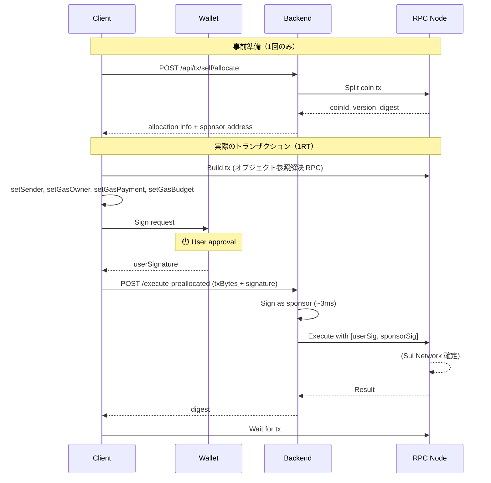
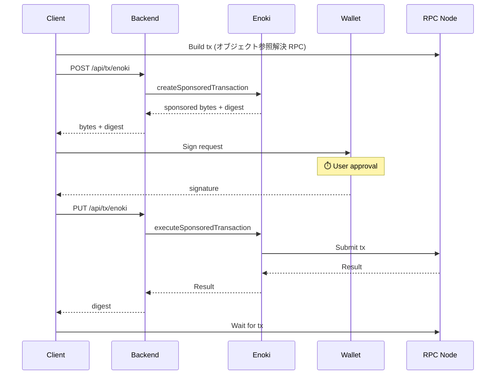

# Sponsored Transaction

## 概要

Sui のスポンサードトランザクションは、ユーザーの代わりにスポンサーがガス代を支払う仕組み。
本プロジェクトでは 3 つの方式を実装している。

## 本質的なオーバーヘッド

すべての方式で避けられない処理：

| 処理 | 理由 |
|------|------|
| **オブジェクト参照解決 (RPC)** | Sui の UTXO モデルでは `objectId + version + digest` が必要。version/digest は変わるため毎回取得が必要 |
| **ユーザー署名** | セキュリティ上必須。ウォレット UI の表示時間含む |
| **トランザクション実行 (RPC)** | RPC ノードへの送信・確定待ち |

## 3 方式の比較

```text
Normal                 1RT Pre-allocated           Enoki Sponsored
──────────────────     ──────────────────────      ──────────────────────────
[オブジェクト解決]     [オブジェクト解決]          [オブジェクト解決]
        ↓                      ↓                           ↓
[ユーザー署名+実行]    [ユーザー署名]              [Enoki POST: sponsor準備]
        ↓                      ↓                           ↓
      完了             [Backend実行 (1RT)]         [ユーザー署名]
                               ↓                           ↓
                             完了                  [Enoki PUT: 実行]
                                                           ↓
                                                         完了
──────────────────     ──────────────────────      ──────────────────────────
API往復: 0回           API往復: 1回                API往復: 2回
```

| 方式 | ガス代 | API往復 | 用途 |
|------|--------|---------|------|
| **Normal** | ユーザー負担 | 0 | 日常操作、高頻度 |
| **1RT Pre-allocated** | スポンサー負担 | 1 | ガス代ゼロ + 高速 |
| **Enoki Sponsored** | スポンサー負担 | 2 | オンボーディング、設定不要 |

## 実測値 (testnet)

```text
┌─ Normal Transaction ─────────────────────────┐
│  1. Build (resolve+gas):   611ms             │
│  2. Sign:                 3693ms  ⏱️ user    │
│  3. Execute:              2901ms             │
│  4. Wait for tx:           130ms             │
├──────────────────────────────────────────────┤
│  System time only:        3642ms             │
└──────────────────────────────────────────────┘

┌─ Pre-allocated 1RT Transaction ──────────────┐
│  1. Build (with coin):      387ms            │
│  2. Sign:                  3711ms  ⏱️ user   │
│  3. Execute (1RT):         2989ms            │
│  4. Wait for tx:            219ms            │
├──────────────────────────────────────────────┤
│  System time only:         3594ms            │
└──────────────────────────────────────────────┘

┌─ Enoki Sponsored Transaction ────────────────┐
│  1. Build:                 232ms             │
│  2. Sponsor (POST):        581ms             │
│  3. Sign:                 3359ms  ⏱️ user    │
│  4. Execute (PUT):        3169ms             │
│  5. Wait for tx:           216ms             │
├──────────────────────────────────────────────┤
│  System time only:        4197ms             │
└──────────────────────────────────────────────┘
```

⏱️ = ユーザー操作待ち時間（System time から除外）

### 時間収支 (MECE)

| 処理 | 必須? | Normal | 1RT | Enoki |
|------|-------|--------|-----|-------|
| **Build (オブジェクト解決)** | ✅ 必須 | - | 387ms | 232ms |
| **Build (ガス見積もり)** | スキップ可 | 611ms (含む) | - | - |
| **Sponsor API** | 方式依存 | - | - | 581ms |
| **ユーザー署名** | ✅ 必須 | ⏱️ | ⏱️ | ⏱️ |
| **トランザクション実行** | ✅ 必須 | 2,901ms | 2,989ms | 3,169ms |
| **確定待ち** | ✅ 必須 | 130ms ※ | 219ms | 216ms |
| **System time 合計** | | **~3,640ms** | **~3,600ms** | **~4,200ms** |

※ Normal の確定待ちが短いのは署名数の違い（1 vs 2）による署名検証オーバーヘッドの差。

**結論**: トランザクション実行時間は3方式でほぼ同等 (~2,900-3,200ms)。RPC ノードへの送信と Sui Network の確定処理は共通インフラのため差が出ない。

### Owned vs Shared Counter

Shared Counter でも同様の計測を実施した結果：

| 方式 | Owned Execute | Shared Execute | 差分 |
|------|---------------|----------------|------|
| Normal | 2,901ms | 2,800-3,100ms | 誤差範囲 |
| 1RT | 2,989ms | 2,900-3,000ms | 誤差範囲 |
| Enoki | 3,169ms | 1,100-3,400ms | 高バラつき |

**知見**:

- **オブジェクト種別（owned/shared）による性能差はない** - RPC ノード遅延が支配的要因
- Enoki の Execute 時間には高いバラつきがある（1,102ms〜3,440ms）- Enoki サーバー側の負荷状況に依存

**凡例**:

- ✅ 必須: 全方式で避けられない処理
- スキップ可: `setGasBudget()` で固定値指定により回避可能
- 方式依存: 特定の方式でのみ発生
- ⏱️: ユーザー操作待ち（System time から除外）

### 最適化ポイント

| 処理 | 最適化方法 |
|------|-----------|
| オブジェクト参照解決 | 不可（Sui の UTXO モデル上必須） |
| ガス見積もり | `setGasBudget()` で固定値指定 → スキップ (~300ms 削減) |
| Sponsor API | 1RT 方式で Enoki 経由を回避 (~600ms 削減) |
| トランザクション実行 | RPC ノードの遅延に依存（制御不可） |
| 確定待ち | RPC ノードの遅延に依存（制御不可） |

## フロー詳細

### 1RT Pre-allocated Transaction



### Enoki Sponsored Transaction



## ユースケース判断

```text
ユーザーがガス代を払える？
├─ Yes → Normal（最速）
└─ No → 自前スポンサー運用できる？
         ├─ Yes → 1RT Pre-allocated
         └─ No → Enoki Sponsored（設定簡単）
```

## 実装ファイル

| ファイル | 役割 |
|---------|------|
| [usePreallocatedTransaction.ts](../src/hooks/usePreallocatedTransaction.ts) | 1RT Pre-allocated フック |
| [useCoinAllocation.ts](../src/hooks/useCoinAllocation.ts) | コインアロケーション管理 |
| [self-sponsor.ts](../src/app/api/[[...route]]/routes/self-sponsor.ts) | 1RT バックエンド API |
| [useSponsoredTransaction.ts](../src/hooks/useSponsoredTransaction.ts) | Enoki Sponsored フック |
| [enoki-sponsor.ts](../src/app/api/[[...route]]/routes/enoki-sponsor.ts) | Enoki バックエンド API |
| [useCounter.tsx](../src/hooks/useCounter.tsx) | Normal トランザクション |

## 環境変数

```bash
# .env.local

# Enoki Sponsored 用
NEXT_PUBLIC_ENOKI_API_KEY=enoki_public_xxx
ENOKI_SECRET_KEY=enoki_private_xxx

# 1RT Pre-allocated 用
SPONSOR_PRIVATE_KEY=suiprivkey1xxx
```

## 参考

- [Enoki Documentation](https://docs.enoki.mystenlabs.com/)
- [Sui Sponsored Transactions](https://docs.sui.io/concepts/transactions/sponsored-transactions)
