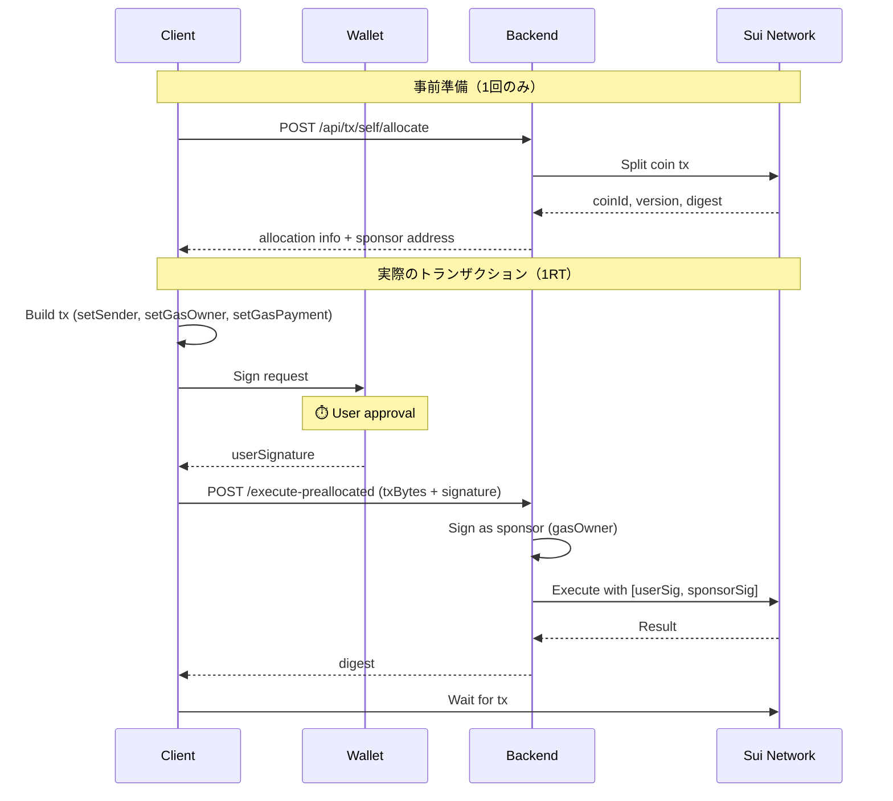
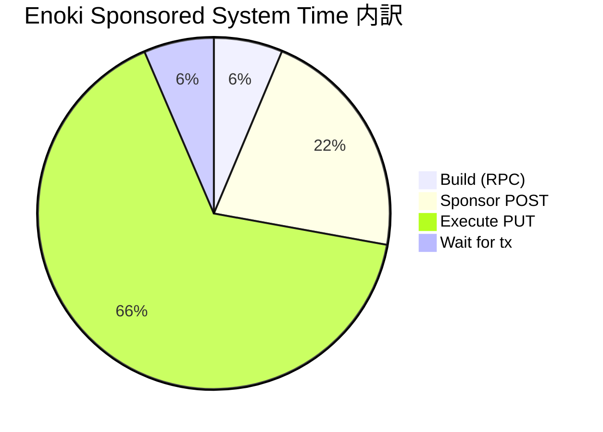

# Sponsored Transaction

## 結論

| 方式 | System Time | API Calls | 用途 |
|------|-------------|-----------|------|
| **Normal** | ~100ms | 1 (wallet経由) | 日常操作、高頻度、パフォーマンス重視 |
| **1RT Pre-allocated** | ~450-800ms | 1 (事前allocate済み) | 高速＋ガス代ゼロ |
| **Enoki Sponsored** | ~2,000-4,600ms | 3 (POST→Sign→PUT) | オンボーディング、設定不要 |

**1RTはEnokiの5-10倍速く、Normalに近いパフォーマンスでガス代をゼロにできる。**

## 3方式の比較

```text
Normal                 1RT Pre-allocated           Enoki Sponsored
──────────────────     ──────────────────────      ──────────────────────────
1. Build:       0ms    1. Build:        50-100ms   1. Build:         200ms
2. Sign+Exec: ⏱️ user  2. Sign:         ⏱️ user    2. Sponsor POST:  500-1000ms
3. Invalidate: 100ms   3. Execute:      200-400ms  3. Sign:          ⏱️ user
                       4. Wait:         200-300ms  4. Execute PUT:   1200-3200ms
                                                   5. Wait:          200ms
──────────────────     ──────────────────────      ──────────────────────────
System: ~100ms         System: ~450-800ms          System: ~2000-4600ms
```

⏱️ = ユーザー操作待ち時間（System timeから除外）

## 1RT Pre-allocated Transaction

### 概要

事前にスポンサーからガス用コインを割り当て（allocate）しておき、クライアントが既知のcoinIdでトランザクションを構築・署名し、バックエンドへ1回のAPI呼び出しで実行する方式。

### フロー



### なぜ速いか

1. **事前アロケーション**: coinId/version/digestが既知なので、ビルド時に追加RPC不要
2. **単一API呼び出し**: Enokiの2往復（POST→PUT）が1往復に削減
3. **直接実行**: Enoki経由ではなく、Backend→Sui Networkへ直接送信

### 想定時間内訳

```text
┌─ Pre-allocated 1RT Transaction ──────────────┐
│                                              │
│  1. Build (with coin):       50ms            │
│  2. Sign:                  3000ms  ⏱️ user   │
│  3. Execute (1RT):          300ms            │
│  4. Wait for tx:            250ms            │
│                                              │
├──────────────────────────────────────────────┤
│  Total (wall clock):       3600ms            │
│  System time only:          600ms            │
│  (excludes user approval wait)               │
└──────────────────────────────────────────────┘
```

### トランザクション構成

```typescript
// Client側
transaction.setSender(userAddress);           // ユーザーが送信者
transaction.setGasOwner(sponsorAddress);      // スポンサーがガス支払い
transaction.setGasPayment([{
  objectId: allocation.coinId,
  version: allocation.version,
  digest: allocation.digest,
}]);

// Build & Sign
const txBytes = await transaction.build({ client });
const { signature: userSignature } = await wallet.signTransaction(txBytes);

// Backend側
const { signature: sponsorSignature } = await sponsorKeypair.signTransaction(txBytes);
await client.executeTransactionBlock({
  transactionBlock: txBytes,
  signature: [userSignature, sponsorSignature],  // 両方の署名
});
```

## Enoki Sponsored Transaction

### Enoki概要

Mysten LabsのEnokiサービスを利用したスポンサードトランザクション。設定が簡単だが、Enoki APIを経由するため遅延が大きい。

### Enokiフロー


### ボトルネック



**Execute PUT** が最大のボトルネック（全体の65%）。

- Enoki → Sui Network → Enoki → Backend → Client の往復
- ネットワーク状況により1〜3秒のばらつき

## 計測結果（実測値）

### Owned Counter

| 指標 | Normal | 1RT (想定) | Enoki Sponsored |
|------|--------|------------|-----------------|
| **System time** | 109ms | 450-800ms | 4,633ms |
| Wall clock | 7,865ms | ~4,000ms | 7,877ms |

### Shared Counter

| 指標 | Normal | Enoki (1回目) | Enoki (2回目) |
|------|--------|---------------|---------------|
| **System time** | 102-107ms | 2,368ms | 4,067ms |
| Wall clock | 7,044-8,019ms | 6,418ms | 7,669ms |

## ユースケース判断

| 方式 | 推奨シーン |
|------|-----------|
| **Normal** | 日常操作、高頻度、ゲーム内アクション |
| **1RT Pre-allocated** | ガス代ゼロ＋高速が必要、リピートユーザー |
| **Enoki Sponsored** | オンボーディング、初回体験、設定の手間を省きたい |

### 選択フローチャート

```text
ユーザーがガス代を払える？
├─ Yes → Normal（最速）
└─ No → パフォーマンス重視？
         ├─ Yes → 1RT Pre-allocated
         └─ No → Enoki Sponsored（設定簡単）
```

## 実装ファイル

| ファイル | 役割 |
|---------|------|
| [usePreallocatedTransaction.ts](../src/hooks/usePreallocatedTransaction.ts) | 1RT Pre-allocatedフック |
| [useCoinAllocation.ts](../src/hooks/useCoinAllocation.ts) | コインアロケーション管理 |
| [self-sponsor.ts](../src/app/api/[[...route]]/routes/self-sponsor.ts) | 1RT バックエンドAPI |
| [useSponsoredTransaction.ts](../src/hooks/useSponsoredTransaction.ts) | Enoki Sponsoredフック |
| [enoki-sponsor.ts](../src/app/api/[[...route]]/routes/enoki-sponsor.ts) | Enoki バックエンドAPI |
| [useCounter.tsx](../src/hooks/useCounter.tsx) | Normalトランザクション |

## デバッグ

ブラウザコンソールでボックス形式のログが出力される。

```text
┌─ Normal Transaction ─────────────────────────┐
│  1. Build:                  0ms            │
│  2. Sign+Execute:        7755ms  ⏱️ user  │
│  3. Invalidate:           109ms            │
├──────────────────────────────────────────────┤
│  System time only:        109ms            │
└──────────────────────────────────────────────┘

┌─ Pre-allocated 1RT Transaction ──────────────┐
│  1. Build (with coin):      50ms            │
│  2. Sign:                 3000ms  ⏱️ user  │
│  3. Execute (1RT):         300ms            │
│  4. Wait for tx:           250ms            │
├──────────────────────────────────────────────┤
│  System time only:         600ms            │
└──────────────────────────────────────────────┘

┌─ Enoki Sponsored Transaction ────────────────┐
│  1. Build:                217ms            │
│  2. Sponsor (POST):      1001ms            │
│  3. Sign:                3243ms  ⏱️ user  │
│  4. Execute (PUT):       3196ms            │
│  5. Wait for tx:          219ms            │
├──────────────────────────────────────────────┤
│  System time only:       4633ms            │
└──────────────────────────────────────────────┘
```

## 参考

- [Enoki Documentation](https://docs.enoki.mystenlabs.com/)
- [Sui Sponsored Transactions](https://docs.sui.io/concepts/transactions/sponsored-transactions)
