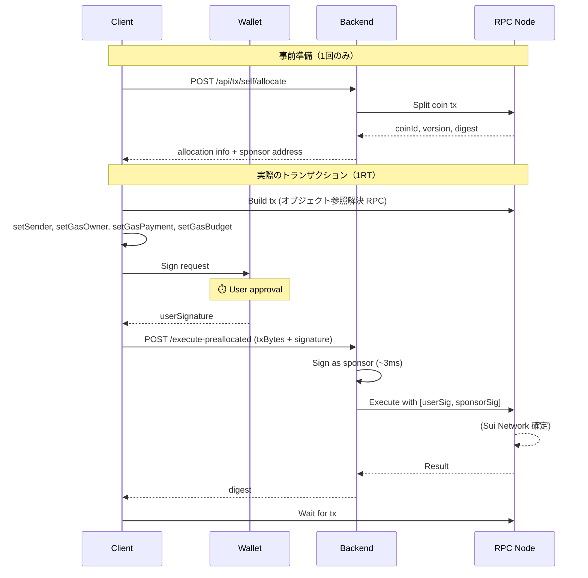
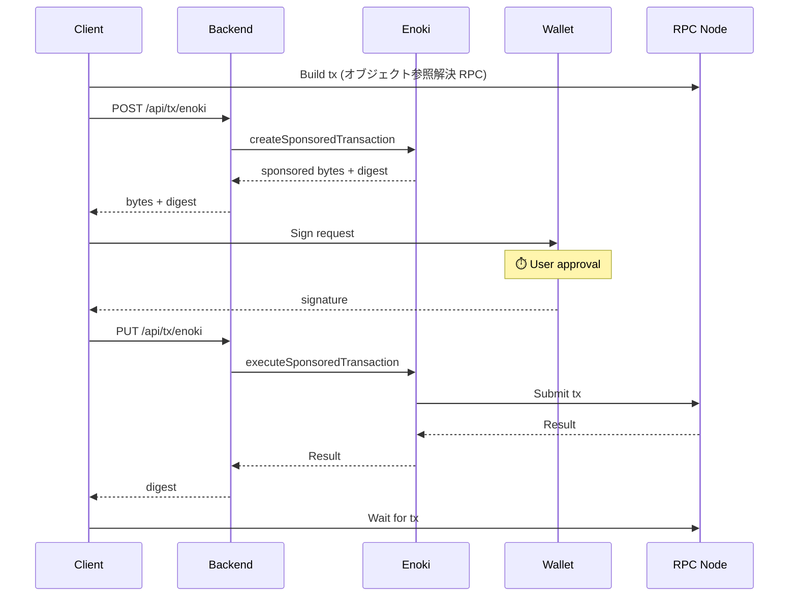

# Sponsored Transaction

## 概要

Sui のスポンサードトランザクションは、ユーザーの代わりにスポンサーがガス代を支払う仕組み。
本プロジェクトでは 3 つの方式を実装している。

## 本質的なオーバーヘッド

すべての方式で避けられない処理：

| 処理 | 理由 |
|------|------|
| **オブジェクト参照解決 (RPC)** | Sui の UTXO モデルでは `objectId + version + digest` が必要。version/digest は変わるため毎回取得が必要 |
| **ユーザー署名** | セキュリティ上必須。ウォレット UI の表示時間含む |
| **トランザクション実行 (RPC)** | RPC ノードへの送信・確定待ち |

## 3 方式の比較

```text
Normal                 1RT Pre-allocated           Enoki Sponsored
──────────────────     ──────────────────────      ──────────────────────────
[オブジェクト解決]     [オブジェクト解決]          [オブジェクト解決]
        ↓                      ↓                           ↓
[ユーザー署名+実行]    [ユーザー署名]              [Enoki POST: sponsor準備]
        ↓                      ↓                           ↓
      完了             [Backend実行 (1RT)]         [ユーザー署名]
                               ↓                           ↓
                             完了                  [Enoki PUT: 実行]
                                                           ↓
                                                         完了
──────────────────     ──────────────────────      ──────────────────────────
API往復: 0回           API往復: 1回                API往復: 2回
```

| 方式 | ガス代 | API往復 | 用途 |
|------|--------|---------|------|
| **Normal** | ユーザー負担 | 0 | 日常操作、高頻度 |
| **1RT Pre-allocated** | スポンサー負担 | 1 | ガス代ゼロ + 高速 |
| **Enoki Sponsored** | スポンサー負担 | 2 | オンボーディング、設定不要 |

## 実測値 (testnet)

```text
┌─ Normal Transaction ─────────────────────────┐
│                                              │
│  1. Build (resolve+gas):      531ms          │
│  2. Sign:                    3596ms  ⏱️ user │
│  3. POST to RPC:              570ms          │
│  4. Finalize:                 209ms          │
│                                              │
├──────────────────────────────────────────────┤
│  System time only:           1310ms          │
└──────────────────────────────────────────────┘

┌─ Pre-allocated 1RT Transaction ──────────────┐
│                                              │
│  1. Build (with coin):        340ms          │
│  2. Sign:                    3738ms  ⏱️ user │
│  3. POST to API (1RT):        939ms          │
│  4. Finalize:                1270ms          │
│                                              │
├──────────────────────────────────────────────┤
│  System time only:           2549ms          │
└──────────────────────────────────────────────┘

┌─ Enoki Sponsored Transaction ────────────────┐
│                                              │
│  1. Build:                    253ms          │
│  2. Sponsor (POST):           765ms          │
│  3. Sign:                    3658ms  ⏱️ user │
│  4. PUT (POST+Finalize):     3276ms  ※Enoki  │
│  5. Finalize (client):        239ms          │
│                                              │
├──────────────────────────────────────────────┤
│  System time only:           4533ms          │
│  ※ Enoki PUT = POST + Finalize 一体化        │
└──────────────────────────────────────────────┘
```

⏱️ = ユーザー操作待ち時間（System time から除外）

**用語の定義**:

- **POST to RPC / POST to API**: トランザクションを RPC ノードまたは Backend API に送信する処理
- **Finalize**: トランザクション確定を待つ処理（クライアント側で `waitForTransaction` を呼び出し）

**1RT の POST vs Finalize について**:
1RT Pre-allocated では「Server submits, Client waits」設計により、サーバーは POST のみ（~600-1,300ms）で即座に応答し、Finalize（~200-2,300ms）はクライアント側で実行される。トータルの System time は同等だが、責務が明確に分離されている。

### 時間収支 (MECE)

| 処理 | 必須? | Normal | 1RT | Enoki |
|------|-------|--------|-----|-------|
| **Build (オブジェクト解決)** | ✅ 必須 | 531ms (含む) | 340ms | 253ms |
| **Sponsor API** | 方式依存 | - | - | 765ms |
| **ユーザー署名** | ✅ 必須 | ⏱️ | ⏱️ | ⏱️ |
| **POST (送信)** | ✅ 必須 | 570ms | 939ms | 3,276ms (※) |
| **Finalize (確定待ち)** | ✅ 必須 | 209ms | 1,270ms | 239ms |
| **System time 合計** | | **~1,310ms** | **~2,549ms** | **~4,533ms** |

※ Enoki PUT は POST + Finalize が内部で一体化されている

**結論**: Normal が最も高速（~1,300ms）。1RT は ~2,500ms、Enoki は ~4,500ms。差は主に Sponsor API のオーバーヘッドと Enoki 内部での確定待ち。

### Owned vs Shared Counter

オブジェクト種別（owned/shared）による性能差はない。RPC ノード遅延が支配的要因。

**知見**:

- Enoki の PUT 時間には高いバラつきがある（~3,200-3,350ms） - Enoki サーバー側の負荷状況に依存
- 1RT の Backend 処理（Sign + Execute）は ~530-950ms と安定（自前サーバーのため）
- POST と Finalize の時間配分は RPC ノードの状態により変動する

**凡例**:

- ✅ 必須: 全方式で避けられない処理
- 方式依存: 特定の方式でのみ発生
- ⏱️: ユーザー操作待ち（System time から除外）

### 最適化ポイント

| 処理 | 最適化方法 |
|------|-----------|
| オブジェクト参照解決 | 不可（Sui の UTXO モデル上必須） |
| ガス見積もり | `setGasBudget()` で固定値指定 → スキップ可能 |
| Sponsor API | 1RT 方式で Enoki 経由を回避（~700ms 削減） |
| POST (送信) | RPC ノードの遅延に依存（制御不可） |
| Finalize (確定待ち) | RPC ノードの遅延に依存（制御不可） |

## フロー詳細

### 1RT Pre-allocated Transaction



### Enoki Sponsored Transaction



## ユースケース判断

```text
ユーザーがガス代を払える？
├─ Yes → Normal（最速）
└─ No → 自前スポンサー運用できる？
         ├─ Yes → 1RT Pre-allocated
         └─ No → Enoki Sponsored（設定簡単）
```

## 実装ファイル

| ファイル | 役割 |
|---------|------|
| [usePreallocatedTransaction.ts](../src/hooks/usePreallocatedTransaction.ts) | 1RT Pre-allocated フック |
| [useCoinAllocation.ts](../src/hooks/useCoinAllocation.ts) | コインアロケーション管理 |
| [self-sponsor.ts](../src/app/api/[[...route]]/routes/self-sponsor.ts) | 1RT バックエンド API |
| [useSponsoredTransaction.ts](../src/hooks/useSponsoredTransaction.ts) | Enoki Sponsored フック |
| [enoki-sponsor.ts](../src/app/api/[[...route]]/routes/enoki-sponsor.ts) | Enoki バックエンド API |
| [useCounter.tsx](../src/hooks/useCounter.tsx) | Normal トランザクション |

## 環境変数

```bash
# .env.local

# Enoki Sponsored 用
NEXT_PUBLIC_ENOKI_API_KEY=enoki_public_xxx
ENOKI_SECRET_KEY=enoki_private_xxx

# 1RT Pre-allocated 用
SPONSOR_PRIVATE_KEY=suiprivkey1xxx
```

## 設計原則

「Server submits, Client waits」の設計原則については [Cloudflare Workers 考慮事項](../../docs/cloudflare-workers-considerations.md) を参照。

## 参考

- [Enoki Documentation](https://docs.enoki.mystenlabs.com/)
- [Sui Sponsored Transactions](https://docs.sui.io/concepts/transactions/sponsored-transactions)
