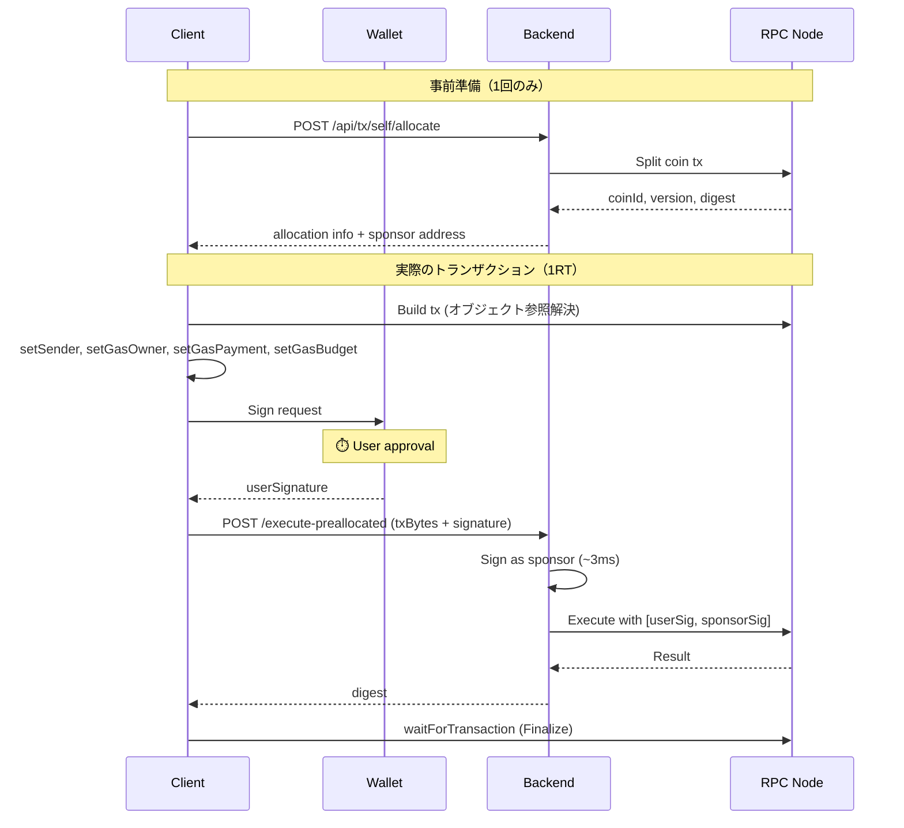
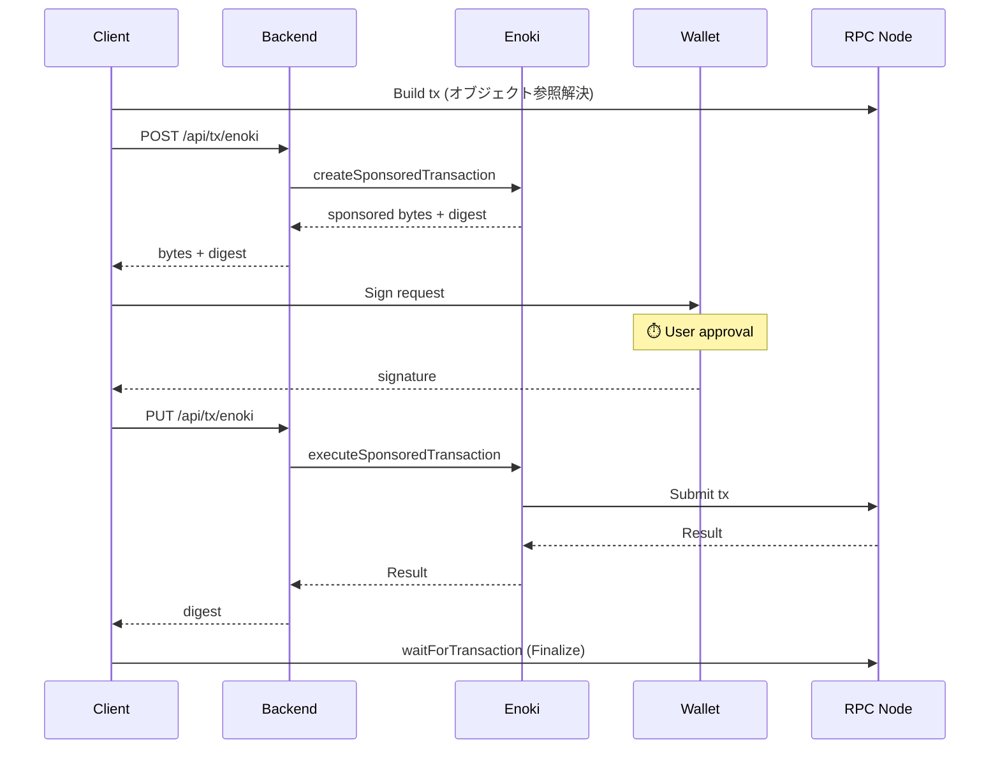

# Sponsored Transaction

## 概要

Sui のスポンサードトランザクションは、ユーザーの代わりにスポンサーがガス代を支払う仕組み。
本プロジェクトでは 3 つの方式を実装している。

## トランザクション処理の時間構成

### 用語定義

| 用語 | 説明 |
|------|------|
| **Build** | オブジェクト参照解決（RPC）+ トランザクション構築 |
| **Sign** | ユーザーのウォレット署名（⏱️ ユーザー操作待ち） |
| **POST** | トランザクションを RPC/API に送信（= RTT） |
| **Finalize** | トランザクション確定を待つ（`waitForTransaction`） |

### POST = RTT（Round Trip Time）

POST の ~500-600ms は **ネットワーク RTT** である：

```text
Client (日本) ──→ RPC Node (US) ──→ Client
              └──── ~500-600ms ────┘
```

**内訳**:

| 要因 | 時間 |
|------|------|
| 太平洋横断 RTT | ~150-200ms |
| RPC ノード処理 | ~50-100ms |
| トランザクション初期検証 | ~100-200ms |
| **合計** | **~300-500ms** |

**testnet vs mainnet**:

| 環境 | RTT | 理由 |
|------|-----|------|
| **testnet** | ~500-600ms | US リージョンのみ、無料枠 |
| **mainnet** | ~100-200ms (期待値) | Asia リージョン RPC 選択可能（Triton, Shinami 等） |

testnet の RTT は「遠い + 無料枠」のペナルティ。本番では大幅改善が見込める。

## 3 方式の比較

```text
Normal                 1RT Pre-allocated           Enoki Sponsored
──────────────────     ──────────────────────      ──────────────────────────
[Build]                [Build]                     [Build]
    ↓                      ↓                           ↓
[Sign] ⏱️              [Sign] ⏱️                   [Sponsor API]
    ↓                      ↓                           ↓
[POST]                 [POST to Backend]           [Sign] ⏱️
    ↓                      ↓                           ↓
[Finalize]             [Finalize]                  [Enoki PUT (POST+Finalize)]
    ↓                      ↓                           ↓
  完了                   完了                       [Finalize (client)]
                                                       ↓
                                                     完了
──────────────────     ──────────────────────      ──────────────────────────
API往復: 0回           API往復: 1回                API往復: 2回
```

| 方式 | ガス代 | API往復 | 用途 |
|------|--------|---------|------|
| **Normal** | ユーザー負担 | 0 | 日常操作、高頻度 |
| **1RT Pre-allocated** | スポンサー負担 | 1 | ガス代ゼロ + 高速 |
| **Enoki Sponsored** | スポンサー負担 | 2 | オンボーディング、設定不要 |

## 実測値 (testnet, 日本から)

```text
┌─ Normal Transaction ─────────────────────────┐
│                                              │
│  1. Build (resolve+gas):      531ms          │
│  2. Sign:                    3596ms  ⏱️ user │
│  3. POST to RPC:              570ms  ← RTT   │
│  4. Finalize:                 209ms          │
│                                              │
├──────────────────────────────────────────────┤
│  System time only:           1310ms          │
└──────────────────────────────────────────────┘

┌─ Pre-allocated 1RT Transaction ──────────────┐
│                                              │
│  1. Build (with coin):        340ms          │
│  2. Sign:                    3738ms  ⏱️ user │
│  3. POST to API (1RT):        939ms  ← RTT×2 │
│  4. Finalize:                1270ms          │
│                                              │
├──────────────────────────────────────────────┤
│  System time only:           2549ms          │
└──────────────────────────────────────────────┘

┌─ Enoki Sponsored Transaction ────────────────┐
│                                              │
│  1. Build:                    253ms          │
│  2. Sponsor (POST):           765ms  ← RTT   │
│  3. Sign:                    3658ms  ⏱️ user │
│  4. PUT (POST+Finalize):     3276ms  ※Enoki  │
│  5. Finalize (client):        239ms          │
│                                              │
├──────────────────────────────────────────────┤
│  System time only:           4533ms          │
│  ※ Enoki PUT = POST + Finalize 一体化        │
└──────────────────────────────────────────────┘
```

⏱️ = ユーザー操作待ち時間（System time から除外）

### 時間収支

| 処理 | Normal | 1RT | Enoki |
|------|--------|-----|-------|
| **Build** | 531ms | 340ms | 253ms |
| **Sponsor API** | - | - | 765ms |
| **Sign** | ⏱️ | ⏱️ | ⏱️ |
| **POST** | 570ms | 939ms | 3,276ms (※) |
| **Finalize** | 209ms | 1,270ms | 239ms |
| **System time** | **1,310ms** | **2,549ms** | **4,533ms** |

※ Enoki PUT は POST + Finalize が内部で一体化

**結論**: Normal が最速（~1.3s）。スポンサー方式は RTT 増加分だけ遅くなる。

### 本番環境での期待値

Asia リージョン RPC 使用時（RTT ~100-200ms と仮定）:

| 方式 | testnet | mainnet (期待値) |
|------|---------|------------------|
| Normal | ~1,310ms | **~500-800ms** |
| 1RT | ~2,549ms | **~1,000-1,500ms** |
| Enoki | ~4,533ms | **~2,500-3,500ms** |

## 設計原則: Server submits, Client waits

詳細は [Cloudflare Workers 考慮事項](../../docs/cloudflare-workers-considerations.md) を参照。

```text
┌─ Server ─────────────────┐     ┌─ Client ────────────────┐
│ 1. Sign (sponsor)        │     │                         │
│ 2. POST to RPC           │ ──→ │ 3. Finalize             │
│ 3. Return digest         │     │    (waitForTransaction) │
└──────────────────────────┘     └─────────────────────────┘
```

サーバーは送信のみ、クライアントが確定待ちを担当。

## フロー詳細

### 1RT Pre-allocated Transaction



### Enoki Sponsored Transaction



## ユースケース判断

```text
ユーザーがガス代を払える？
├─ Yes → Normal（最速）
└─ No → 自前スポンサー運用できる？
         ├─ Yes → 1RT Pre-allocated
         └─ No → Enoki Sponsored（設定簡単）
```

## 実装ファイル

| ファイル | 役割 |
|---------|------|
| [useCounter.tsx](../src/hooks/useCounter.tsx) | Normal トランザクション |
| [usePreallocatedTransaction.ts](../src/hooks/usePreallocatedTransaction.ts) | 1RT Pre-allocated フック |
| [useCoinAllocation.ts](../src/hooks/useCoinAllocation.ts) | コインアロケーション管理 |
| [self-sponsor.ts](../src/app/api/[[...route]]/routes/self-sponsor.ts) | 1RT バックエンド API |
| [useSponsoredTransaction.ts](../src/hooks/useSponsoredTransaction.ts) | Enoki Sponsored フック |
| [enoki-sponsor.ts](../src/app/api/[[...route]]/routes/enoki-sponsor.ts) | Enoki バックエンド API |

## 環境変数

```bash
# .env.local

# Enoki Sponsored 用
NEXT_PUBLIC_ENOKI_API_KEY=enoki_public_xxx
ENOKI_SECRET_KEY=enoki_private_xxx

# 1RT Pre-allocated 用
SPONSOR_PRIVATE_KEY=suiprivkey1xxx
```


## 参考

- [Enoki Documentation](https://docs.enoki.mystenlabs.com/)
- [Sui Sponsored Transactions](https://docs.sui.io/concepts/transactions/sponsored-transactions)
