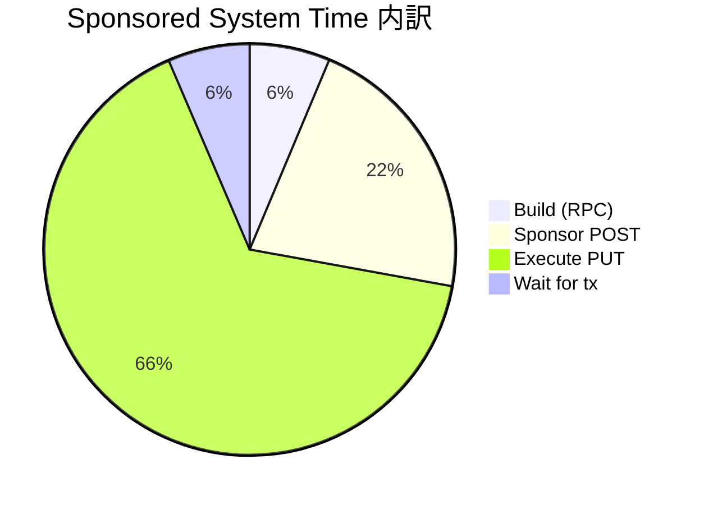
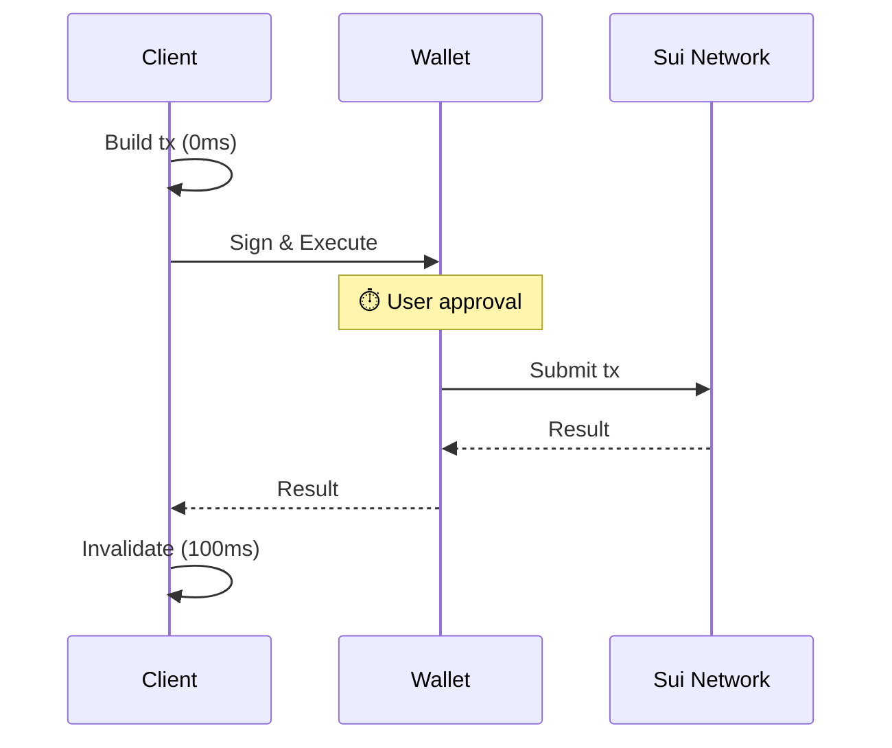
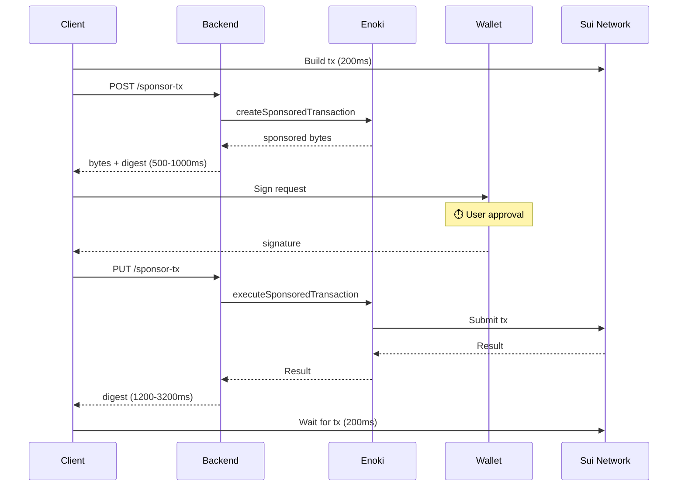

# Sponsored Transaction (Enoki)

## 結論

| 方式 | System Time | 用途 |
|------|-------------|------|
| **Normal** | ~100ms | 日常操作、高頻度、パフォーマンス重視 |
| **Sponsored** | ~2,000-4,600ms | オンボーディング、ガス代なしで体験させたい場面 |

**Sponsoredは約20-40倍遅いが、ユーザーのガス代をゼロにできる。**

## 計測結果

### Owned Counter

| 指標 | Normal | Sponsored | 差分 |
|------|--------|-----------|------|
| **System time** | 109ms | 4,633ms | +4,524ms (42倍) |
| Wall clock | 7,865ms | 7,877ms | ほぼ同じ |

### Shared Counter

| 指標 | Normal | Sponsored (1回目) | Sponsored (2回目) |
|------|--------|-------------------|-------------------|
| **System time** | 102-107ms | 2,368ms | 4,067ms |
| Wall clock | 7,044-8,019ms | 6,418ms | 7,669ms |

### 内訳

```text
Normal                                Sponsored
────────────────────────────          ────────────────────────────────────
1. Build:              0-1ms          1. Build:              211-217ms
2. Sign+Execute:   7,000-8,000ms ⏱️   2. Sponsor (POST):     457-1,001ms
3. Invalidate:     102-109ms          3. Sign:           3,200-4,000ms ⏱️
                                      4. Execute (PUT):  1,200-3,200ms
                                      5. Wait for tx:        212-224ms
────────────────────────────          ────────────────────────────────────
System time:       ~100ms             System time:       2,000-4,600ms
```

⏱️ = ユーザー操作待ち時間を含む（System timeから除外）

## ボトルネック



**Execute PUT** が最大のボトルネック（全体の65%）。

- Enoki → Sui Network → Enoki → Backend → Client の往復
- ネットワーク状況により1〜3秒のばらつき

## 経路比較

### Normal Transaction



### Sponsored Transaction



## 発見

1. **Owned vs Shared: 差なし** — 所有権モデルはEnoki経路に影響しない
2. **Sponsoredのばらつきが大きい** — Execute PUTが1,200〜3,200msで変動
3. **Wall clockはほぼ同じ** — ユーザー体感時間は変わらない（署名待ちが支配的）

## ユースケース判断

| Sponsored推奨 | Normal推奨 |
|--------------|------------|
| オンボーディング | 日常操作 |
| 無料体験 | 高頻度トランザクション |
| 初回NFT mint | リアルタイム性重視 |
| ガス持ってないユーザー | ゲーム内頻繁アクション |

## 実装ファイル

| ファイル | 役割 |
|---------|------|
| [useSponsoredTransaction.ts](../src/hooks/useSponsoredTransaction.ts) | Sponsoredフック |
| [useCounter.tsx](../src/hooks/useCounter.tsx) | Normalトランザクション |
| [sponsor-tx/route.ts](../src/app/api/sponsor-tx/route.ts) | バックエンドAPI |
| [OwnedCounter.tsx](../src/components/OwnedCounter.tsx) | Owned UI |
| [SharedCounter.tsx](../src/components/SharedCounter.tsx) | Shared UI |

## デバッグ

ブラウザコンソールでボックス形式のログが出力される。

```text
┌─ Normal Transaction ─────────────────────────┐
│  1. Build:                  0ms            │
│  2. Sign+Execute:        7755ms  ⏱️ user  │
│  3. Invalidate:           109ms            │
├──────────────────────────────────────────────┤
│  System time only:        109ms            │
└──────────────────────────────────────────────┘

┌─ Sponsored Transaction ──────────────────────┐
│  1. Build:                217ms            │
│  2. Sponsor (POST):      1001ms            │
│  3. Sign:                3243ms  ⏱️ user  │
│  4. Execute (PUT):       3196ms            │
│  5. Wait for tx:          219ms            │
├──────────────────────────────────────────────┤
│  System time only:       4633ms            │
└──────────────────────────────────────────────┘
```

## 参考

- [Enoki Documentation](https://docs.enoki.mystenlabs.com/)
